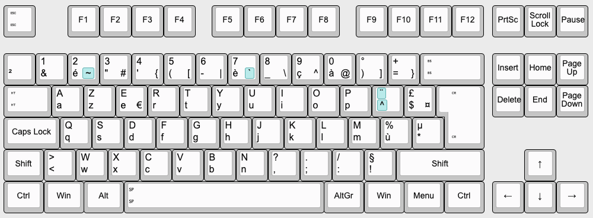

<!-- PROJECT LOGO -->
<p align="center">
  <h3 align="center">Karabiner Config files</h3>

  <p align="center">
   Personnal config files for AZERTY windows keyboard on macOS
  </p>
</p>
</br>
</br>

<p align="center">
  <a href="http://www.kbdlayout.info/kbdfr/10.0.17134.1/overview%2Bnothing">
    
  <h4 align="center">Target keyboard layout</h3>
  </a>
</p>
</br>

### Prerequisites

You'll need to have [Karabiner](https://karabiner-elements.pqrs.org/) on your Mac.

### Installation

1. Clone the repo in the correct config folder

```bash
$ git clone git@github.com:cchanche/karabiner_rules.git ~/.config/karabiner/assets/complex_modifications/
```

2. Add rules in Karabiner-Elements > Complex modifications
